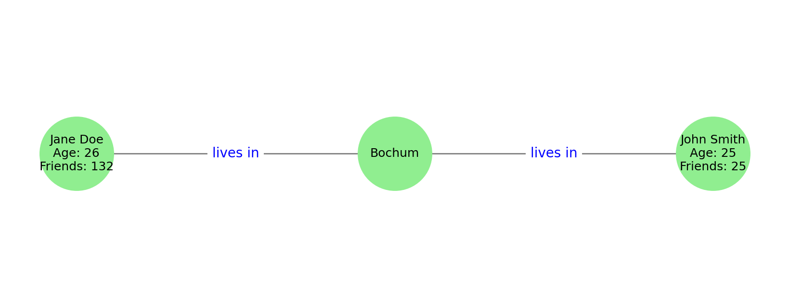

# Structured and Unstructured Data - From stories to graphs

---

## Retrieval Championship

> ... Morgan was face to face with the accumulated art and knowledge of all mankind.
>
> In his student days, he had won several retrieval championships, racing against the clock while digging out obscure items of information on lists prepared by ingeniously sadistic judges. (**"What was the rainfall in the capital of the world's smallest national state on the day when the second largest number of home runs was scored in college baseball?"** was one that he recalled with particular affection.) His skill had improved with years, and this was a perfectly straightforward question. The display came up in thirty seconds, in far more detail than he really needed.
>
<details>
<summary>Where is the text from?</summary>
Arthur C. Clarke: THE FOUNTAINS OF PARADISE, 1979
</details>

---

## How would you Solve the Problem...

... with todays' tools?

* fulltext engine (old school)
* modern search engine (linked to knowledge sources)
* faceted search (similar to domain specific search engines)
* multi-hop search
* large language model (LLM)

---

## Structured and Unstructured data

two views on data:

- structured: database view (tables, relations, graphs, ...)
- unstructured: documents as streams of characters

[Klan, 2017](../references.md#Klan2017)

“Unstructured” means unstructured from computational point of view.

Unstructured data have no predefined data model.

However, unstructured data are structured from the human POV.

---

## A Closer Look to Structured Data

A record

```
{
  "firstName": "John",
  "lastName": "Smith",
  "age": 25
}
```

---

## A Closer Look to Structured Data

Table of records

| firstName | lastName | age |
|-----------|----------|----:|
| Jane      | Doe      | 26  |
| John      | Smith    | 25  |


What information do we put in columns?

---

## What Makes Structured Data Valuable?

| firstName | lastName | age | city   |
|-----------|----------|----:|--------|
| Jane      | Doe      | 26  | Bochum |
| John      | Smith    | 25  | Bochum |


What information do we put in columns?

* the whole column is typically of the same data type (entities)
* the information in the column can connect the records (relations)

---

## Graphs: Entities + Relations

| firstName | lastName | age | city   | #friends |
| --------- | -------- | --: | ------ | -------: |
| Jane      | Doe      | 26  | Bochum |      132 |
| John      | Smith    | 25  | Bochum |       25 |


*Jane Doe lives in Bochum. So does John Smith. Jane has a lot of friends, while John has only 25 of them.*



::: notes
Important: 

* Bochum == Bochum
* 25 != 25
:::

--- 

## Knowledge Graph Properties

Knowledge graph (KG) is a **model**.

The designer has to make **design choices**.

* decide what is the scope of the model (e.g., domain of the Bochum community)
  * what entities will be in the graph?
  * what relations will be in the graph?
  * will the graph be enriched by some implicit knowledge (e.g., Jane is female, John is male)?
* decide what entities are the same (i.e., point to the same object in the real world)

---

## Graph Model and Schema = RDF

* Resource description framework (RDF)
* Resource description framework schema (RDFS)

* Describe how to model knowledge
* Provides *basic concepts* (in a **vocabulary**)
  * **resource** = node that can be connected to another node
  * **literal** = it makes no sense to connect it to other nodes
  * **statement** = a triple

---

## The Triple

   resource - predicate - resource

   resource - predicate - literal

Resources have **unique identifier**.
For **human readability**, they have labels.
Labels can be in different languages.
Literals can have **data types**.

### Example Labels
```
<TheMonaLisa> <rdfs:label> “The Mona Lisa”@en .
<TheMonaLisa> <rdfs:label> “La Joconde”@fr .
<TheMonaLisa> <rdfs:label> “Mona Lisa”@cs .
<TheMonaLisa> <rdfs:label> “La Gioconda”@it .
```

---

## Now What?

* Structured data can be **converted to** natural language.
  * [check what GPT generated](https://chatgpt.com/share/68793881-805c-8006-8d29-4ccbd0f3ea2f)

* Structured data can easily be **reused** in other situations.
  * Who is in Bochum?
  * What is the average age of people in Bochum?
  * How many friends do people have at maximum?
  * Is it true that older people have more friends?

* Structured data can be obtained from natural language texts using large language models
  * Let's try and [visualize](https://www.ldf.fi/service/rdf-grapher)

---

## Why KGs? Aren't tables enough?

* Yes, in many cases.
* KGs can easily model complex relationships.
  * if the entities are similar in some aspects but very different in others.
* Tables have to be designed *a priori*, extension is difficult.
* KGs can *reveal* existing but hidden information by connecting records (rows) in tables.

---

## Automatic Conversion? Yes!

* Let's try [OpenRefine](https://openrefine.org/)

---

## Summary

* Unstructured data mean streams of characters, but still they can be
  structured for us - humans.
* Structured data are used to model a domain/event/part of our world.
*  Knowledge graphs are a popular model because they are:
  *  easily processed by algorithms
  *  still readable for humans
* Tables can be a source for knowledge graphs
