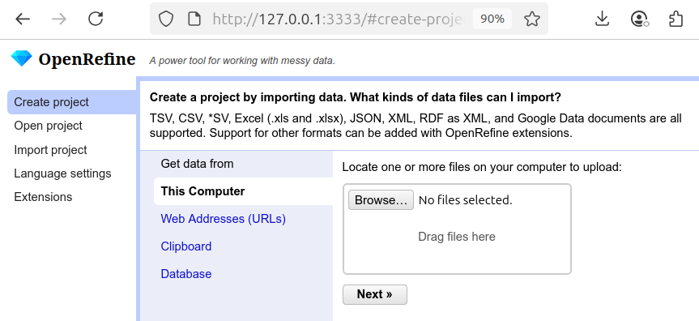
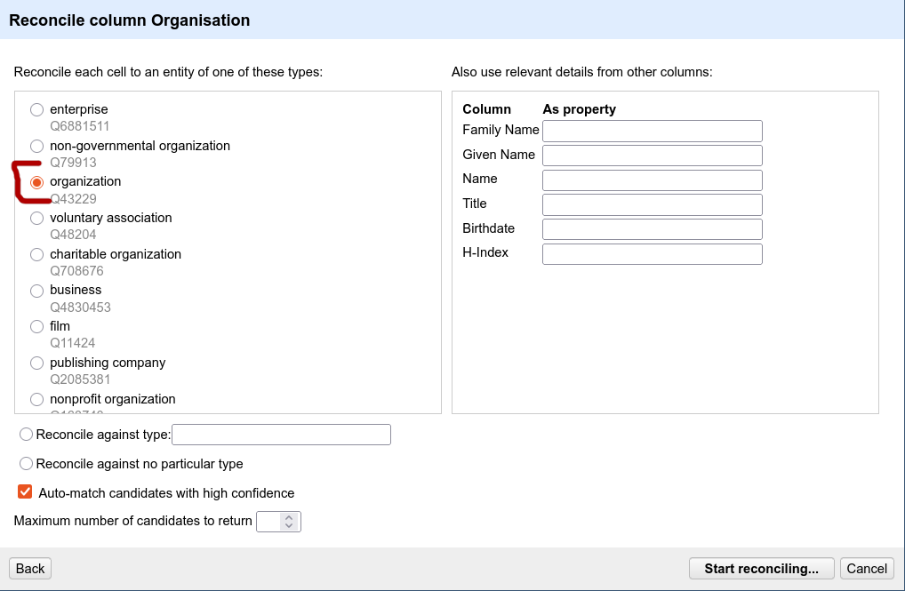
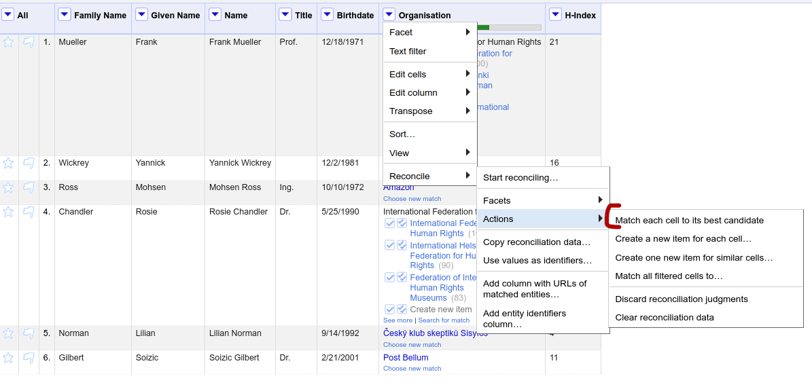
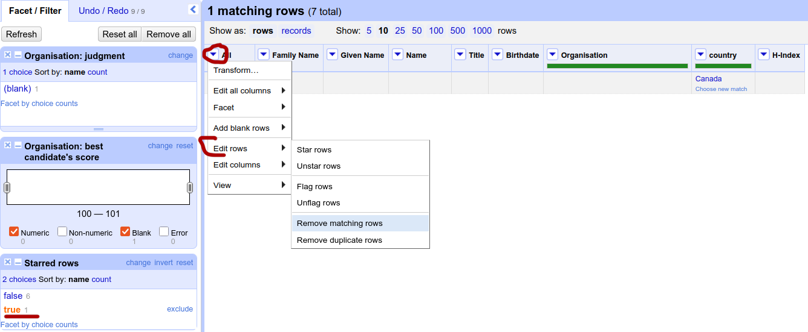

# Day 1: Hands-on

## RDF Grapher

- free
- https://www.ldf.fi/service/rdf-grapher

**TASK**:

Let's have a database table:

```
| firstName | lastName | age | city   | #friends |
| --------- | -------- | --: | ------ | -------: |
| Jane      | Doe      | 26  | Bochum |      132 |
| John      | Smith    | 25  | Bochum |       25 |
```

Convert it into RDF triples. You can write it manually, using the namespace `example.org`:

```
<http://example.org/JaneDoe> <http://example.org/firstName> "Jane" .
<http://example.org/JaneDoe> <http://example.org/lastName> "Doe" .
<http://example.org/JaneDoe> <http://example.org/livesIn> <http://example.org/Bochum> .
...
```

You can easily instruct ChatGPT to create RDF triples from the table above. To obtain the format of triples, instruct the model to output **N-Triples**.

Visualize the result using [RDF Grapher](https://www.ldf.fi/service/rdf-grapher)

Don't forget to select the format in RDF Grapher (Select From format N-Triples).

**TASK**

Convert the table to natural language, either manually or by using a LLM. Next, instruct ChatGPT to create RDF triples from the text.

Again, visualize the result.

## ChatGPT

- free (up to some limit)
- no account needed
- https://chatgpt.com/

Feel free to instruct ChatGPT to do the tasks for you.

## OpenRefine

- free and open
- supports plugins
- https://openrefine.org/

**TASK**: Get familiar with OpenRefine.

### Installation instructions

See the [installation guide](../install-OpenRefine.md)

### Running OpenRefine

In the OpenRefine main directory, run:

```
./refine
```

The application will run in your browser.

### Using OpenRefine

Create new project. Select Browse and upload [example data](OpenRefineExample.csv).



Click on Create Project


Create a new column that will contain the first and last name for each person. Click on Given Name, select Edit column/Join columns. Put a space as a separator. Save the joined column as a new one named Name.


Connect our data with external knowledge (reconcile). Click on the Organization column, and start reconciliation. Select Wikidata reconci.link.


Select the organization concept (Q43229) because it seems to cover all the organizations in the data.



In case of an ambiguous result, you can check the proposed entities and select them manually. The other option is to let OpenRefine decide.



Now, let's add a new column with the country where the organization is located.

Click on Reconcile/Add columns from reconciled data and select country.


Because Amazon has two countries in Wikidata, a new row was created. Let's remove it manually.

Click on star in row 4.


A new facet will appear on the left panel. Select true to limit the data to starred rows.


Remove matching rows.



Finally, click the cross of the facet to see the whole data again.

**OPTIONAL** You can play around with other Wikidata relations and add field of work, organization website, chiefperson etc.

**OPTIONAL** You can use OpenRefine to fix spelling. Click on the Organization column, select Reconcile/Use values as identifiers. It will correct Amazon to Amazon, Inc. as it is the correct company name.


### Example data

[example data](OpenRefineExample.csv)
