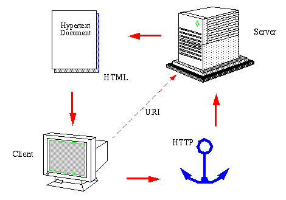
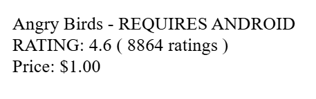
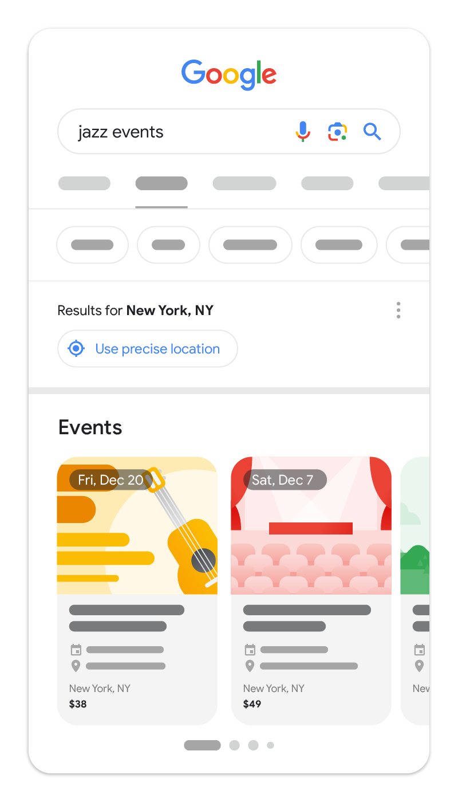

# Web Technologies

---

## Wayback Machine

> In 1989, Sir Tim Berners-Lee invented the World Wide Web (see the [original proposal](https://www.w3.org/History/1989/proposal.html)). He coined the term "World Wide Web," wrote the first World Wide Web server, "httpd," and the first client program (a browser and editor), "WorldWideWeb," in October 1990.
>
> He wrote the first version of the "HyperText Markup Language" (HTML), the document formatting language with the capability for hypertext links that became the primary publishing format for the Web. His initial specifications for URIs, HTTP, and HTML were refined and discussed in larger circles as Web technology spread.
>
> -- [https://www.w3.org/about/history/](History | W3C)

---

## WWW Components



Image from [https://www.w3.org/People/Frystyk/thesis/WWW.html]

* server (httpd)
* clients 
* markup language
* protocol (HTTP)
* identifiers (URI, URL)
* navigation (hypertext)

---

## Component: URI = Uniform Resource Identifier

* worldwide unique
* uniform = with same syntax accross object types
* resource = whatever that is worth linking
  * article
  * web page
  * multimedia
  * service
  * abstract entities (e.g., the sum function)
* not necessarily accessible on the Internet

---

## URI Syntax

```
URI = scheme ":" hier-part [ "?" query ] [ "#" fragment ]
      hier-part = "//" authority path-abempty
                  / path-absolute
                  / path-rootless
                  / path-empty
```


---

## URI Example

```
foo://example.com:8042/over/there?name=ferret#nose
\_/   \______________/\_________/ \_________/ \__/
 |              |         |            |        |
scheme     authority     path        query   fragment
 |   _____________________|__
/ \ /                        \
urn:example:animal:ferret:nose
```

### Sidenote: URI? URL? URN? IRI?

* originally, URI = URL (Locator) or URN (Name)
* nowadays, URL stands for URI
* later, IRI = Internationalized (UTF-8 characters are allowed)

---

## Origins of the Semantic Web

> The Semantic Web is not a separate Web but an extension of the current one, in which information is given well-defined meaning, better enabling computers and people to work in cooperation.
>
> For the semantic web to function, computers must have access to *structured collections of information* and sets of inference rules that they can use to conduct *automated reasoning*.
>
> -- Tim Berners-Lee et al. 2001 in [Scientific American: The Semantic Web](https://www-sop.inria.fr/acacia/cours/essi2006/Scientific%20American_%20Feature%20Article_%20The%20Semantic%20Web_%20May%202001.pdf)

---

## Web X.0

* 1.0 - links between **web pages** (HTML, CGI, graphics)
* 2.0 - links between **applications** (AJAX, APIs, responsivity)
* 3.0 - links between **pieces of knowledge** (semantic search, connectivity)

[Sharma, 2025](../references.md#Sharma2025)

---

## Example: Microdata in HTML

```
<div itemscope itemtype="https://schema.org/SoftwareApplication">
  <span itemprop="name">Angry Birds</span> -

  REQUIRES <span itemprop="operatingSystem">ANDROID</span>
  TYPE: <span itemprop="applicationCategory" content="GameApplication">Game</span>

  RATING:
  <div itemprop="aggregateRating" itemscope itemtype="https://schema.org/AggregateRating">
    <span itemprop="ratingValue">4.6</span> (
    <span itemprop="ratingCount">8864</span> ratings )
  </div>

  <div itemprop="offers" itemscope itemtype="https://schema.org/Offer">
    Price: $<span itemprop="price">1.00</span>
    <meta itemprop="priceCurrency" content="USD" />
  </div>
</div>
```

---

## Example: JSON-LD in HTML

```
<html>
  <head>
    <title>Angry Birds</title>
    <script type="application/ld+json">
    {
      "@context": "https://schema.org",
      "@type": "SoftwareApplication",
      "name": "Angry Birds",
      "operatingSystem": "ANDROID",
      "applicationCategory": "GameApplication",
      "aggregateRating": {
        "@type": "AggregateRating",
        "ratingValue": 4.6,
        "ratingCount": 8864
      },
      "offers": {
        "@type": "Offer",
        "price": 1.00,
        "priceCurrency": "USD"
      }
    }
    </script>
  </head>
  <body>
  </body>
</html>
```

---

## What is it good for?



---

Google's point-of-view: rich results

- [Microdata](https://search.google.com/test/rich-results/result?id=aaPWxYJcGkrIa-K4j2nNIQ)
- [JSON-LD](https://search.google.com/test/rich-results/result?id=b6AY_uRQEfEvQUP9O_0gFQ)

> Google uses structured data to understand the content on the page and show that content in a richer appearance in search results, which is called a rich result.

[Structured data markup that Google Search supports](https://developers.google.com/search/docs/appearance/structured-data/search-gallery)


<!-- event rich result](event-rich-result.png -->

*Search results:* article, breadcrumb, carousel, course list, dataset, discussion forum, education Q&A, event, FAQ, image metadata, job posting, local business, math solver, movie, organization, practice problem, product, profile page, Q&A, recipe, review snippet, software app, speakable, subscription and paywalled content, vacation rental, video

---

## Back to the JSON-LD Example

```
    {
      "@context": "https://schema.org",
      "@type": "SoftwareApplication",
      "name": "Angry Birds",
      "operatingSystem": "ANDROID",
      "applicationCategory": "GameApplication",
      "aggregateRating": {
        "@type": "AggregateRating",
        "ratingValue": 4.6,
        "ratingCount": 8864
      }
    }
```

### Where are these entities from?
* SoftwareApplication
* GameApplication
* AggregateRating

---

## Are Structured Data Used?

Check [the stats](https://webdatacommons.org/structureddata/2024-12/stats/schema_org_subsets.html)

---

## Hands-on

* Browse on your own [schema.org](https://www.schema.org)
* Check the [JSON-LD plaground](https://json-ld.org/playground/)

---

## The Four Rules for Linked Data

1. Use URIs as names for things
1. Use HTTP URIs so that people can look up those names.
1. When someone looks up a URI, provide useful information, using the standards (RDF*, SPARQL)
1. Include links to other URIs. so that they can discover more things.

[Berners-Lee, 2006](../references.md#TBL2006)

---

## The Five Stars of Linked Open Data

------------------------  ----------------------------------------------------
&ast;                     Available on the web (whatever format) 
                          but with an open licence, to be Open Data

&ast;&ast;                Available as machine-readable structured 
                          data (e.g. excel instead of image scan 
                          of a table)

&ast;&ast;&ast;           As (2) plus non-proprietary format (e.g.
                          CSV instead of excel)

&ast;&ast;&ast;&ast;      All the above plus, Use open standards 
                          from W3C (RDF and SPARQL) to identify 
                          things, so that people can point at your 
                          stuff

&ast;&ast;&ast;&ast;&ast; All the above, plus: Link your data to 
                          other people’s data to provide context
------------------------  ----------------------------------------------------

[Berners-Lee, 2006](../references.md#TBL2006)

---

# Semantic Web technologies

---

## The Triple

```
statement: <subject> <predicate> <object>
```

### Conditions

1. everything is a resource
1. resources have URLs
1. the `<object>` can be a literal

---

## Statements

about individuals

```
<TimBernersLee> <isA> <inventor>
```

about classes

```
<inventor> <isA> <human>
```

---

## How about complex statements?

```
<TimBernersLee> <isA> <inventor> <ofTheWWW>
```

* create complex nodes
  * `inventorOfTheWWW`
* reification
  * rotate 90 degrees `:-)`

---

## Complex nodes

```
<TimBernersLee> <isA> <inventorOfTheWWW>
<inventorOfTheWWw> <isA> <inventor>
<inventorOfTheWWw> <hasTopic> <WorldWideWeb>
```

---

## Reification

```
<statement> <hasSubject> <TimBernersLee>
<statement> <hasPredicate> <isA>
<statement> <hasObject> <inventor>
<statement> <hasTopic> <WorldWideWeb>
```

---

## Summary

* although the initial idea of the semantic web has not been realized, a lot of technologies and ideas were adopted:
  * worldwide unique identifiers
  * link as much as possible
  * standardization of data
* knowledge graphs are part of modern search engines
  * to directly answer users questions
  * machines interchange information about goods, events, and other searchable things

