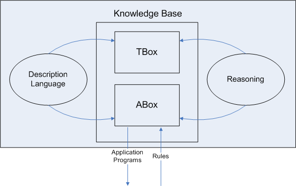
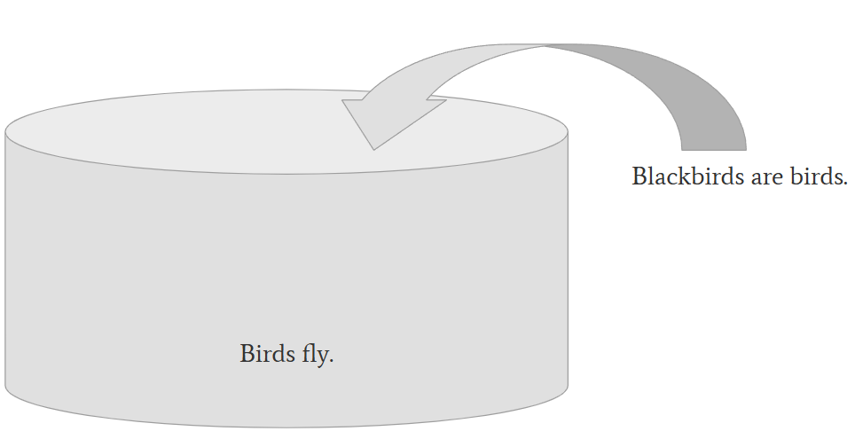
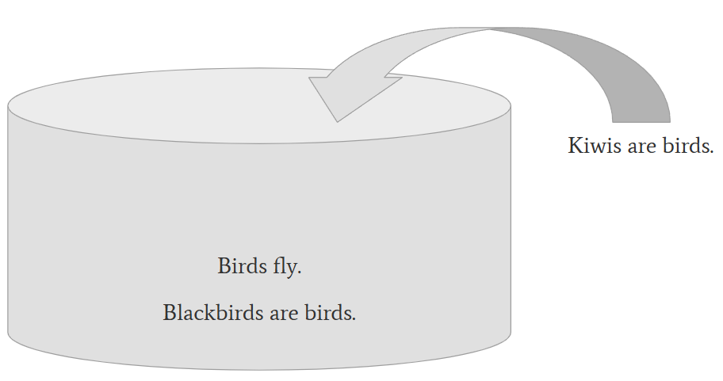
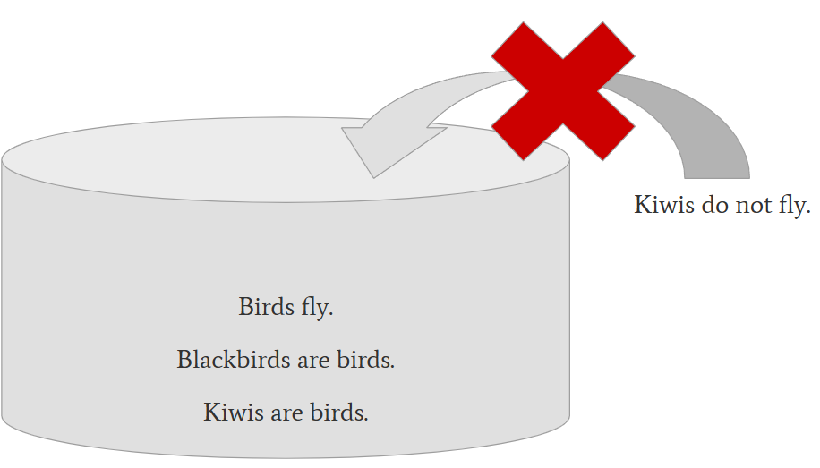

# Logic and Inference

---

# First-order predicate logic (FOPL)

---

## FOPL Components

| FOPL                       |
|----------------------------|
| constants, variables       |
| predicates (unary, binary) |
| quantifiers                |
| logical connectives        |
| expressions                |
| formulas                   |


---

## FOPL and Natural Language

* FOPL: formula is a (mathematical) fact
* Language: Statement

Both can have a truth value:

* Tim-Berners Lee invented the World Wide Web.
* greater_than(x, 5)

---

## FOPL and Inference

We can infer new facts:

* All humans are mortal.
* Socrates is a human.
* Therefore, Socrates is mortal.

---

## Try to Convert in FOPL

- Hello.
- What is the weather today?
- We arrived to Bochum, Germany.
- Billy kicked the ball into the goal and started jumping for joy.
- Some students attended the course.
- Nobody likes rainy weather.

<details>
<summary>Tips</summary>
 What should the predicate be?<br>
 What should the variables/constants be?<br>
 What is the relation between conjunctions and logical operators AND, OR?<br>
 What are the quantifiers in natural language?
</details>

---

## Problems with FOPL Conversion

* not all sentences can be converted into FOPL formulae
* natural language sentence can have different interpretations

Almost every hour, an American dies of melanoma.

$\exists a \forall h: die(a, h)$

$\forall h \exists a: die(a, h)$

### Other Ambiguity Types

* Sisters reunited after ten years in checkout line at Safeway.
* The chicken is ready to eat.
* The princess wants to marry the strongest knight in the kingdom.

---

## FOPL and the AND operator

> Billy kicked the ball into the goal and started jumping for joy.

The “and” means that both events happened *in a sequence*.

> Billy started jumping for joy and kicked the ball into the goal.

---

## Individuals and Roles

> The princess wants to marry the strongest knight in the kingdom.

### Individual/Role Ambiguity and Inference

* Kamala Harris wanted to become the President of the US.
* Donald Trump became the President of the US.
* $\rightarrow$ Kamala Harris wanted to become Donald Trump.

### FOPL Predicates

WantsToBecome(k, PresidentOfUS)

WantsToBecome(k, d)

PresidentOfUS - is a role (dependent on time)

---

## Concepts and Labels


> Mus syllaba est. Syllaba autem caseum non rodit; mus ergo caseum non rodit.
> (A mouse is a syllable. But a syllable does not gnaw cheese; therefore a mouse does not gnaw cheese.)
>
> -- [Seneca](https://www.loebclassics.com/view/seneca_younger-epistles/1917/pb_LCL075.317.xml)

---

# Description Logic

---

## Description Logic $\subset$ FOPL

* reduces the expressivity of FOPL
* is decidable
* good balance between expressiveness and computational complexity

[Wikipedia](../references.md#WikipediaDescriptionLogic)

---

## DL and FOPL components

| FOPL                       | DL                   |
|----------------------------|----------------------|
| constants, variables       | individual           |
| unary predicates           | concept              |
| binary predicates          | role                 |
| quantifiers                |                      |
| logical connectives        |                      |
| expressions                |                      |
| formulas                   | $\supset$ statements |

axioms = statements present in a knowledge base

### Examples
* Concept: Student(x)
* Role: teaches(Teacher, Course)

---

## DL Restriction over FOPL

* T-Box (terminological box)
* A-Box (assertional box)



(Image from [Description Logics and OWL in the Semantic Web](https://ai.ia.agh.edu.pl/_export/s5/hekate:dl_intro#slide13))

---

## Unique name assumption

* If two elements have the same name, they are one thing.

mus = MusSyllable $\times$ mus = MusAnimal

* If two elements have different name, they can be one thing or two different things.

Mona Lisa $\rightarrow$ MonaLisa

La Joconde $\rightarrow$ MonaLisa

Gioconda $\rightarrow$ MonaLisa

---

## Open World Assumption

* If a fact is not known, its negation is not known as well.

### Closed World Assumption Example

*Train Timetable*

Is there a connection from Bochum to Berlin between 10 am and 11 am on Sunday?
* If no such train cannot be found in the timetable, we can answer No.

---

## DL Operators

* Everything: $\top$
* Nothing: $\bot$
* Every class: $\bot \sqsubseteq C \sqsubseteq \top$
* Intersection/conjunction, union/disjunction, complement/negation $\sqcap$, $\sqcup$, $\neg$
* Universal and existential restriction
* Assertion $a:C$

### Examples

* T = Man $\sqsubseteq$ Person
* T = Woman ≡ Person $\sqcap$ Female
* T = Grandmother ≡ Mother $\sqcup$ ∃hasChild · Parent
* A = Man(JOHN), loves(JOHN, MARY)

Examples from [DLArchive](../resources.md#DLArchive)

---

# Inference

---

## Life without Inference

| Knowledge base                           | Possible queries    | Answers |
|------------------------------------------|---------------------|---------|
| All men are mortal.                      | Are men mortal?     | Yes     |
| Socrates is a man.                       | Is Socrates a man?  | Yes     |
|                                          | Is Socrates mortal? | dunno   |

---

## Inference

= new knowledge from current knowledge and axioms (statements relating roles and concepts)

* implicit fact = what was added implicitly
* inferred fact = what was deduced

### Example
| inference 1                    | inference 2                   |
|--------------------------------|-------------------------------|
| If I oversleep, I'll be late.  | If I oversleep, I'll be late. |
| I wasn't late.                 | I didn't oversleep.           |
|--------------------------------|-------------------------------|

<details>
<summary>What is inferred?</summary>

| formula 1                      | formula 2                     |
|--------------------------------|-------------------------------|
| (O $\rightarrow$ L) AND (NOT L)|(O $\rightarrow$ L) AND (NOT O)|
| (NOT O OR L) AND NOT L         |(NOT O OR L) AND NOT O         |         
| NOT O                          |(NOT O OR L)                   |
| I didn't oversleep.            |I didn't oversleep.            |
|--------------------------------|-------------------------------|

</details>

---

## Monotonicity in KG

The number of implicit and inferred facts **cannot decrease** while the facts are *added*.



---

## Monotonicity in KG

The number of implicit and inferred facts **cannot decrease** while the facts are *added*.



---

## Monotonicity in KG

The number of implicit and inferred facts **cannot decrease** while the facts are *added*.



---

## RDF Inference

RDF Entailment Rules [RDFSemantic, 2004](../references.md#RDFSemantic2004)

Example:

```
rdfs9: 	
uuu rdfs:subClassOf xxx .
vvv rdf:type uuu .
-->
vvv rdf:type xxx .
```

---

## OWL components

| FOPL                       | DL                   | OWL        |
|----------------------------|----------------------|------------|
| constants, variables       | individual           | individual |
| unary predicates           | concept              | class      |
| binary predicates          | role                 | property   |
| quantifiers                |                      |            |
| logical connectives        |                      |            |
| expressions                |                      |            |
| formulas                   | $\supset$ statements |            |

---

##  OWL - Description Logic extension to RDF

* negation
* constraints on properties
* properties can be described as:
  * symmetric property
  * inverse property
  * transitive property
* anonymous classes

Statements are DL formulas. Anonymous classes can be described with complement, intersection, or union.

---

### Example

```
:Person owl:equivalentClass :Human .
:Man rdfs:subClassOf :Human .
:Grandfather owl:intersectionOf (:Man :Parent) .
:hasFather owl:cardinality "1" .
```

---

## Good Practices

* describe commonly known facts (women are humans)
* describe explicitly what is implicit (children differ from elderly)
* use commonly agreed facts (Paris is capital of France, ~~Vaccination causes autism~~)
* reuse what was already modeled (linked data vocabulary - LOV)

---

## Summary

* Knowledge graphs can be used as storage for facts (statements) - a **knowledge base**.
* Inference methods help to keep the knowledge base **logically consistent**.
* Inference also helps to deduce new facts apart from the implicit facts.
* OWL - a powerful subset of FOPL is:
  * decidable (inference can be reached)
  * safe (it prevents T-Box and A-Box mismatch)
