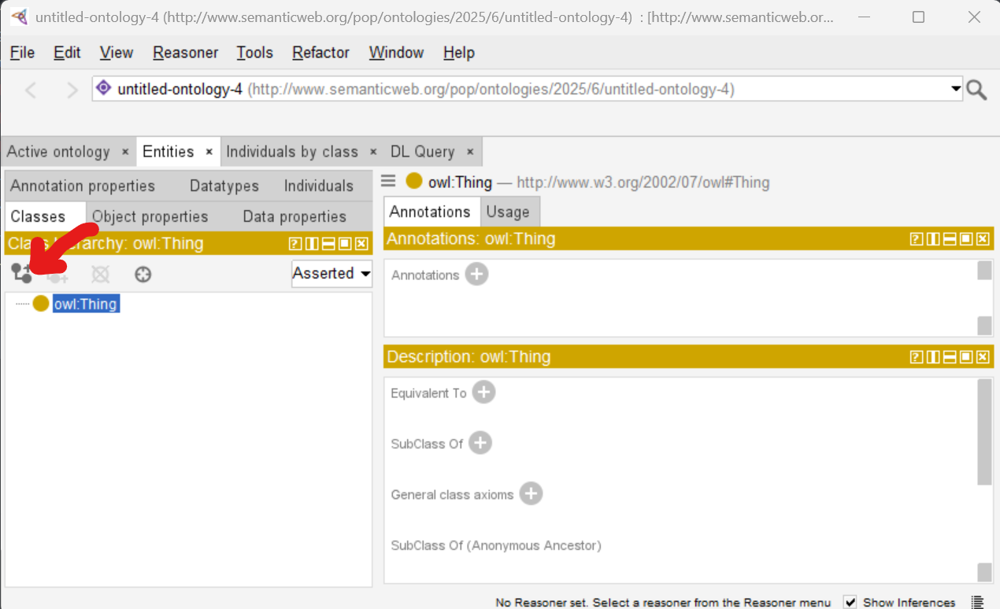
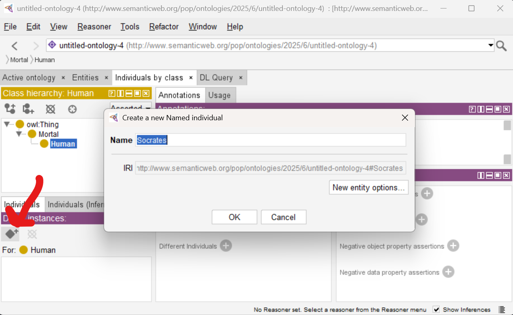
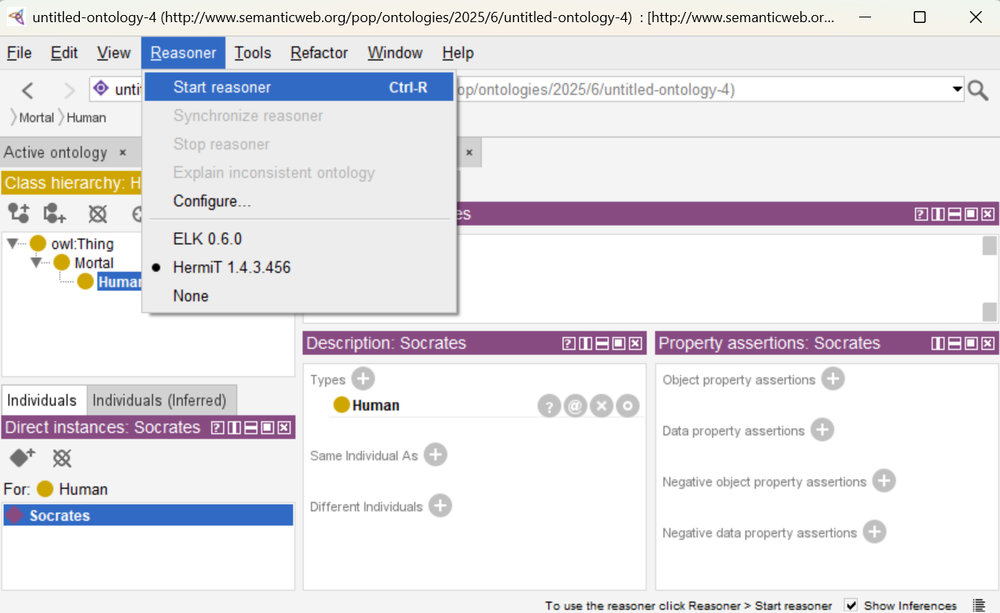
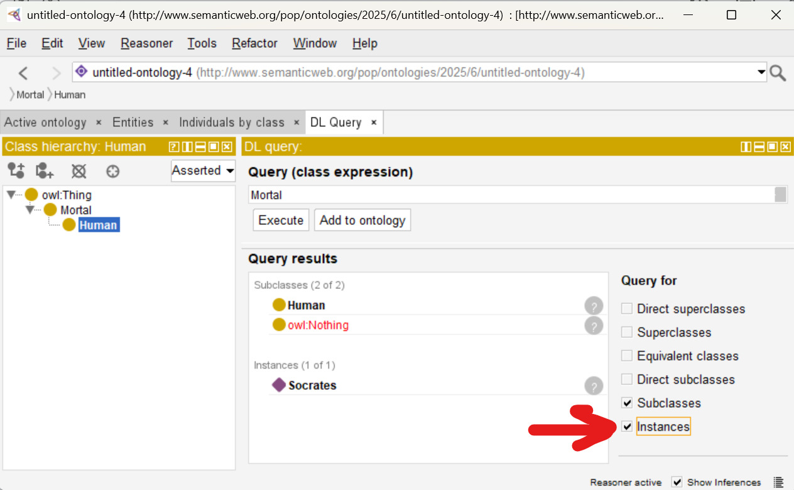
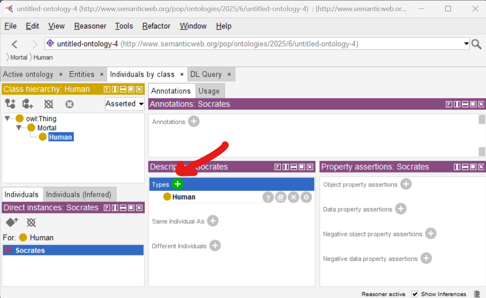
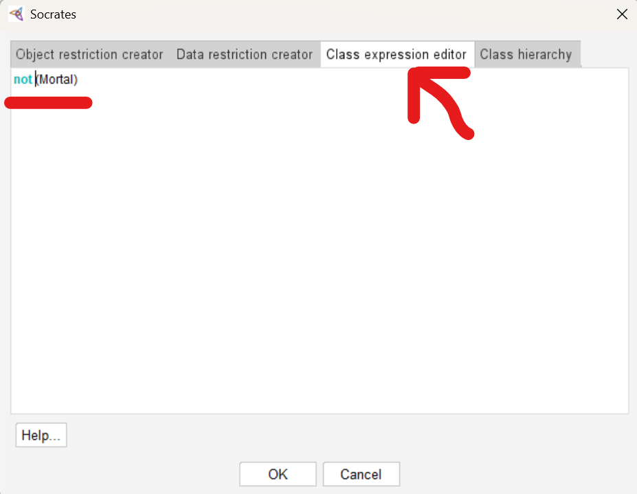

# Day 3: Hands-on

## Protégé

- free and open
- web version: https://webprotege.stanford.edu/ - does not provide reasoning (inference)
- standalone version: https://protege.stanford.edu/ - **use this one**

**TASK**: Get familiar with Protégé.

### Installation instructions

See the [installation guide](../install-Protege.md).

### Model the Syllogism about Socrates

1. Open Protégé.
2. Select Entities, click on `owl:Thing`.
3. Add subclass Mortal. Add its subclass Human. - The ontology models the fact that *All humans are mortal.*

4. Select Individuals by Class.

5. Create instance Socrates.
6. Select a reasoner and start it.

7. Select the DL Query tab.
8. Find all classes and individuals that are Mortal.

9. Go back to Individuals by class.
10. Add a new type for Socrates.

11. State that Socrates is not mortal.

12. Click on Reasoner/Synchronize reasoner.

Now the ontology is inconsistent.
