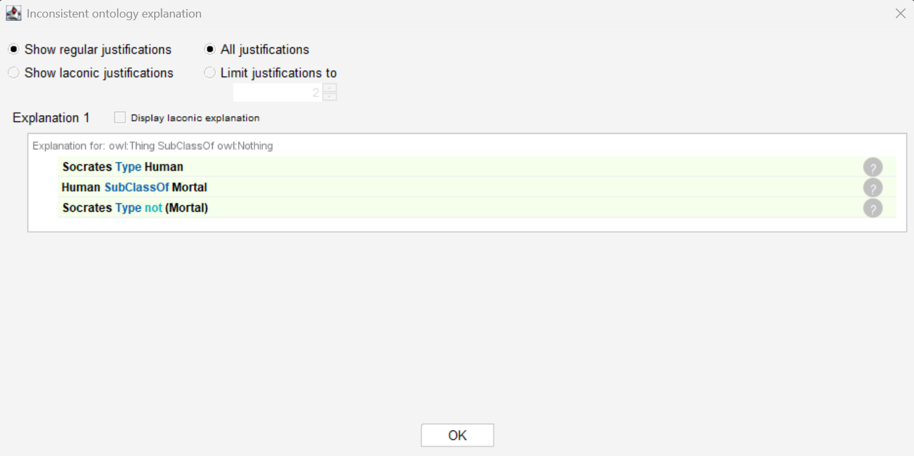
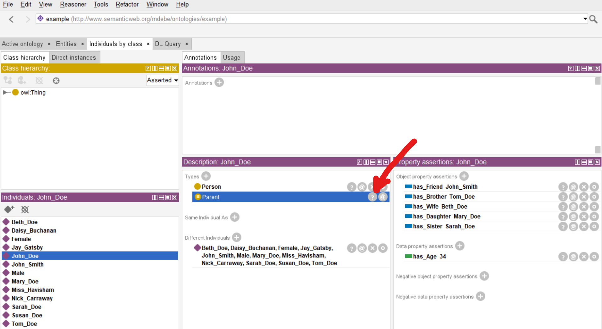

# Day 3: Hands-on

## Protégé

- free and open
- web version: https://webprotege.stanford.edu/ - does not provide reasoning (inference)
- standalone version: https://protege.stanford.edu/ - **use this one**

**TASK**: Get familiar with Protégé.

### Installation instructions

See the [installation guide](../install-Protege.md).

### Model the Syllogism about Socrates

1. Open Protégé.
2. Select Entities, click on `owl:Thing`.

3. Add subclass Mortal. Add its subclass Human. - The ontology models the fact that *All humans are mortal.*
4. Select Individuals by Class.
5. Create instance Socrates.

6. Select a reasoner (preferably ELK) and start it.

7. Select the DL Query tab.
8. Find all classes and individuals that are Mortal.

9. Go back to Individuals by class.
10. Add a new type for Socrates.

11. State that Socrates is not mortal.

12. Click on Reasoner/Synchronize reasoner.

Now the ontology is inconsistent. Protégé can explain why.

**OPTIONAL**

If you are familiar with Protégé, you can explore the People Ontology.

1. Check the data and manual at [Michael DeBellis site](https://www.michaeldebellis.com/post/the-people_example-ontology).
2. Download the `People_Example.owl` and open it in Protégé.
3. Check the individuals.
4. Start a reasoner.
5. You can check inferred properties of individuals (with light yellow background).
6. Click on the question mark to see why a fact was inferred.

7. Experiment with the inference rules within the ontology.

[The People_Example Ontology](../references.md#DeBellis2021)
