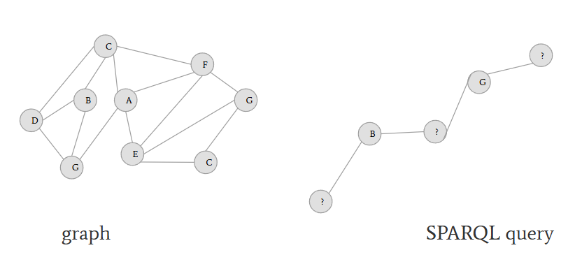
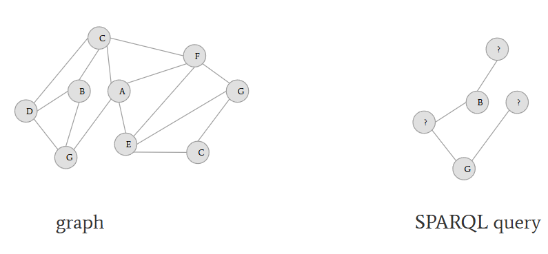
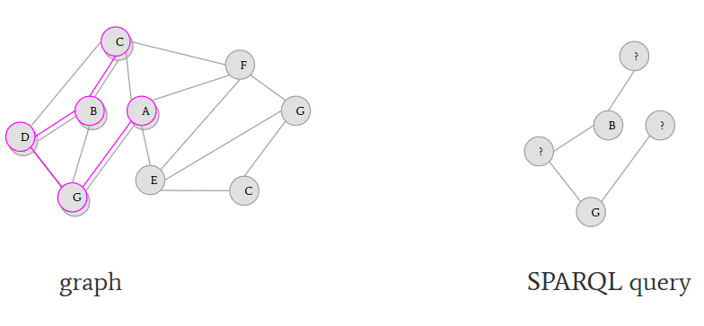
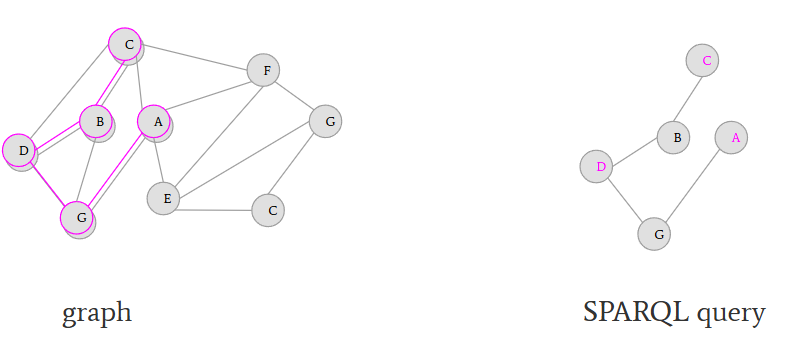
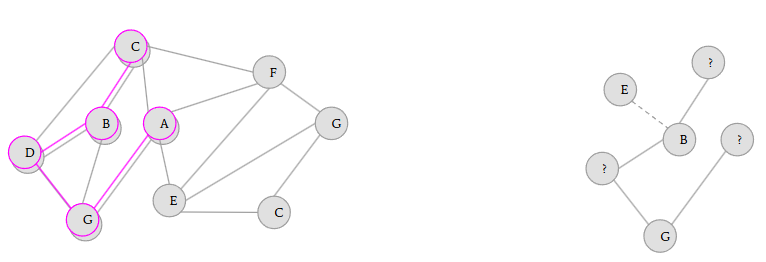
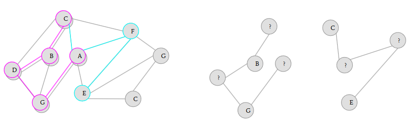

# SPARQL - Knowledge Graph Querying

---

## SPARQL

* is a W3C Recommendation (AKA a web standard)
* uses syntax similar to SQL (database query language)
* the result (answer) of a SPARQL SELECT query is a table

---

## SPARQL Select Pattern

```sparql
SELECT <variables>
  WHERE {
       <subgraph>
  }
```

Answer:

| variable 1 | variable 2 | ... |
|------------|------------|-----|
| value A1   | value B1   | ... |
| value A2   | value B2   | ... |

---

## SPARQL SELECT Variables

```
SELECT <variables>
  WHERE {
       <subgraph>
  }
```

Variables are marked by `?`, e.g. `?person`. Each variable in the `SELECT` part must appear in the `WHERE` part.

It is recommended to use human readable names for variables.

If the table should contain all variables, you can use `SELECT *`.

---

## SPARQL WHERE Clause

```
SELECT <variables>
  WHERE {
       <subgraph>
  }
```

The `subgraph` is a **conjunction** of triples.

```
SELECT ?person
  WHERE {?person :hasFirstName ?firstName .
         ?firstName rdfs:label "Peter" .
        }
```

### Two triples

* unknown (resource) -- `:hasFirstName` -- unknown (resource)
* unknown (resource) -- `rdfs:label` -- "Peter" (literal)

---

## SPARQL Other Commands

```
SELECT <variables>
  WHERE {
       <subgraph>
  }
  <other>
```

### Other commands are

* `LIMIT`
* `ORDER BY`
* ...

---

## SPARQL Prefixes

```
PREFIX rdfs: <http://www.w3.org/2000/01/rdf-schema#>
PREFIX dbo: <http://dbpedia.org/ontology/>

SELECT <variables>
  WHERE {
       <subgraph>
  }
```

### Prefix are shorthands

* `dbo:Book` = `http://dbpedia.org/ontology/Book`

---

## SPARQL WHERE as Graph Pattern Matching



subgraph

---

## SPARQL WHERE as Graph Pattern Matching



the same subgraph

---

## SPARQL WHERE as Graph Pattern Matching



variables can be replaced by real value

---

## SPARQL WHERE as Graph Pattern Matching



variable binding: variables are replaced by what is in the graph

---

## Notes

* a pattern can have 0-many matches
* finding all matches can be computationally intensive

---

## SPARQL Examples

```
SELECT ?book ?author ?date
WHERE {
      ?book a dbo:Book .
      ?book dbo:author ?author .
      ?book dbp:releaseDate ?date .
}
```

| ?book                                      | ?author         | ?date        |
|--------------------------------------------|-----------------|--------------|
|Beijinger in New York                       | Glen Cao        | "1994"       |
|Bridget Jones's Diary                       | Richard Curtis  | "2001-10-29" |
|Planetarian: The Reverie of a Little Planet | Yūichi Suzumoto | "2021-08-25" |

---

## SPARQL Examples: Filtering

```
SELECT ?title ?author_name ?date
WHERE {
       ?book a dbo:Book .
       ?book dbo:author ?author .
       ?book dbp:releaseDate ?date .
       ?author rdfs:label ?author_name .
       ?book rdfs:label ?title .
       FILTER(LANG(?title)="fr" && ?title!="Les Croisés du cosmos")
}
LIMIT 100
```

---

## SPARQL Examples: Aggregation

```
SELECT (sum(?pages) as ?total_number_of_pages)
WHERE {
       ?book a dbo:Book .
       ?book dbo:numberOfPages ?pages.
}
```

---

## SPARQL Examples: Optional

```
SELECT ?first ?last ?nickname WHERE
   {
       ?s :lastName ?last .
       ?s :firstName ?first .
       OPTIONAL {?s :nickname ?nickname. }
   }
```



---

## SPARQL Examples: Union

```
PREFIX dct: <http://purl.org/dc/terms/>
PREFIX dbr: <http://dbpedia.org/resource/>
SELECT * WHERE {
	{ ?place dct:subject dbc:Ruhr }
	UNION
	{ ?place dct:subject dbc:Populated_places_on_the_Rhine }
}
```



---

## Properties of the Graph Queries

* everything in the `WHERE` clause is a **conjunction**
* disjunction can be modeled via `UNION`
* negation is difficult
  * there is a pattern `NOT EXISTS` but it is computationally intensive
* filtering is possible, even with some functions (substring, date conversion, etc.)

---

## Good Practices

* use `LIMIT`
* if the number of results is too high, check the data and set a constraint
* if there are no results, check the data and use `OPTIONAL`
* prefixes use standardized acronyms, most of them can be found at https://prefix.cc/

---

## Summary

* In the previous session, the triples constructed a knowledge graph (KG).
* SPARQL is the way how to ask KG a question.
* Contrary to e.g. web search, SPARQL allows to ask complex questions.
* SPARQL crucial part is the `WHERE` clause with a subgraph.
* The search performs a graph pattern matching and variable binding.
