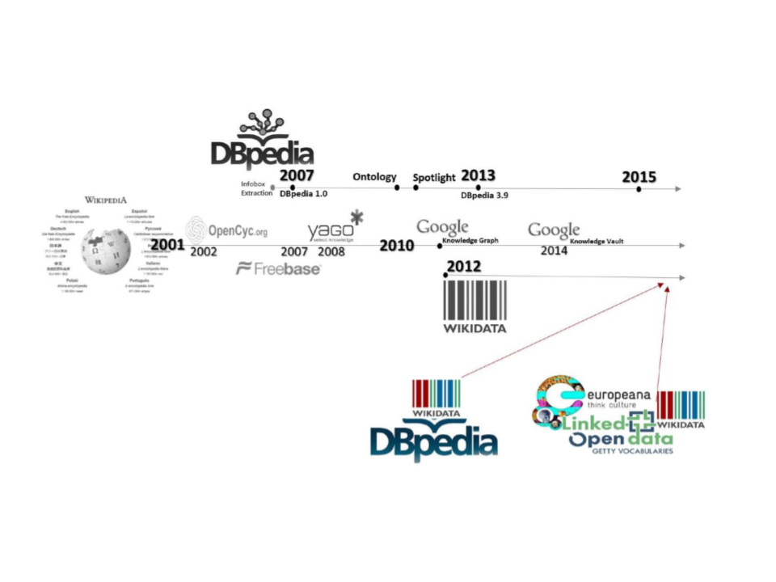

# Additional Materials

---

## Triple Stores

Not an exhaustive list:

* AllegroGraph​
* AnzoGraph​
* Apache Jena + Fuseki + TDB​
* Apache Marmotta + Postgres​
* ArangoDb​
* Blazegraph​
* Cosmos​
* GraphDB​
* MarkLogic​
* Neo4j ​
* Neptune​
* Stardog​
* Tiger​
* Virtuoso​

### Differences

* Scalability (distributed system, multiple pods)
* Data storage method (native triple store, relational database, graph database)
* Inference (RDF, OWL DL 2, custom inference rules)​
* Connectors to other tools (ElasticSearch, Lucene, SOLR)​
* Cloud or on-premises deployment (AWS, Azure, GCP, other)​
* Support (logging, visualization, import, export)​
* Price​

---

## Famous Ontologies and Famous Namespaces

* dbo, dbp, dbr - DBpedia
* wd - Wikidata
* schema - schema.org
* dc, dcterms - Dublin Core, DC terms
* foaf - Friend of a Friend
* geodata - GeoNames
* vcard - VCF
* skos - Simple Knowledge Organization System

Source: https://www.w3.org/wiki/Good_Ontologies

---

### DBPedia

Image source: Harald Sack, Tabea Tietz: Knowledge Graphs 2023. FIZ Karlsruhe. On-line course.
https://open.hpi.de/courses/knowledgegraphs2023/items/7zgzAtXgoj5CxfiX8Yb0Q0

Check the stats: https://www.dbpedia.org/resources/ontology/

---

### Wikidata Knowledge Graph

Difference from DBpedia:

* identifiers are not qualified names (QNames)
* Q-item - for things, P- for properties, L- for lexemes e.g. `P569` = `dateOfBirth`
* reference (source of information, data provenance)
* qualifiers (e.g. startDate-endDate - how long is the information valid?)
* It is not fully W3C compliant (It does not use RDF, RDFS, or OWL.)
* It is a database that has one of the RDF formats and allows queries (also) via SPARQL.
* Wikidata is derived from the Wikimedia database.

---

### Dublin Core - The Ontology of Resources (Librarian Ontology)

* Contributor - An entity responsible for making contributions to the resource
* Coverage - The spatial or temporal topic of the resource, the spatial applicability of the resource, or the jurisdiction under which the resource is relevant
* Creator - An entity primarily responsible for making the resource
* Date - A point or period of time associated with an event in the lifecycle of the resource
* Description - An account of the resource
* Format - The file format, physical medium, or dimensions of the resource
* Identifier - An unambiguous reference to the resource within a given context
* Language - A language of the resource
* Publisher - An entity responsible for making the resource available
* Relation - A related resource
* Rights - Information about rights held in and over the resource
* Source - A related resource from which the described resource is derived
* Subject - The topic of the resource
* Title - A name given to the resource
* Type - The nature or genre of the resource

Check:
https://www.dublincore.org/ and
https://www.dublincore.org/specifications/dublin-core/dces/

---

### SKOS - Simple Knowledge Organization System (W3C standard)

* concepts and schemes Concept, ConceptScheme; notation Notation
* collection Collection
* properties:
broader, narrower, broaderTransitive, related, mappingRelation, definition, example, altLabel, prefLabel, hiddenLabel

https://www.w3.org/2004/02/skos/

---

### FOAF - friend of a friend

Agent  Person: name, title, img, knows, interest, publications

OnlineAccount: accountName

Project Organization Group: member, theme, fundedBy

Document Image: topic, thumbnail

http://xmlns.com/foaf/0.1/

FOAF-a-Matic: http://ldodds.com/foaf/foaf-a-matic.html

---

### GeoNames

* Feature: name, alternateName, countryCode, population, postalCode, parentCountry
* Class: A (country, state, region), H (stream, lake), L (park, area), P (city, village), R (road, railroad), S (spot, building), T (mountain), U (undersea), V (forest),
* Code
wgs84_pos: lat, long (Basic Geo WGS84 https://www.w3.org/2003/01/geo/)

https://www.geonames.org/ontology/documentation.html

Examples: https://www.geonames.org/export/geonames-search.html

---

### Ontologies in the Humanities

* Cultural heritage
  * CIDOC Conceptual Reference Model (CRM)
    * Extension: Linked Art Data Model for cultural heritage
    * Extension: CRM Archeo Excavation Model for archaeology
  * Getty Art and Architecture Thesaurus https://www.getty.edu/research/tools/vocabularies/aat/
  * Europeana Aggregator https://www.europeana.eu/en/search?query=&view=grid&page=1
  * STITCH (Semantic Interoperability to access Cultural Heritage) https://www.cs.vu.nl/STITCH/
* Lexicon modeling - Lemon
* Theme Ontology - https://www.themeontology.org/
* Music Ontology - http://musicontology.com/
* ECPO Enumeration and Chronology of Periodicals Ontology https://cklee.github.io/ecpo/ecpo.htm

Source: https://github.com/CLARIAH/awesome-humanities-ontologies
